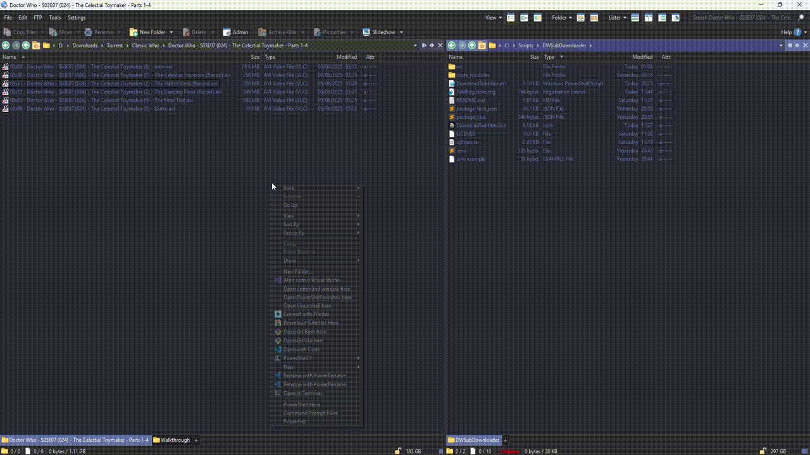

# OpenSubtitle Downloader - WIP

As I am writing this README, I am only planning to work on this as a personal project to 

1) Learn how to work with PowerShell and Windows Registry
2) Have less work when watching Doctor Who episodes. There are 26 seasons and I don't want to download subtitles for each episode manually.

Because of that there will be one specific use case for this project, which is downloading subtitles for Doctor Who episodes. That means the part of the code that defines the query will be specific to how my episodes are named. I will, however, try to make the code as generic as possible so that it can be used for other series as well, but that part will need to be modified to each case. As I'm also not planning to make a GUI for this, it means some coding and Windows knowledge is required to use this project.

The aim is to have a script that will be added to the context menu of Windows Explorer, so that when I right-click on a folder containing Doctor Who episodes, I can select "Download Subtitles" and it will automatically download the subtitles for all episodes in that folder, rename them to match the episode names, and save them in the same folder.

For that I will be using a combination of Node.js (only because I'm already familiarized with it and I thought writing a code in JavaScript would be better then doing everything using the bat file. Python would be probably faster for most people, but I haven't coded in Python for a while), a ps1 file that will run through the folder and call the Node.js script for each episode, and a Windows Registry entry that will add the context menu option.

## Requirements

- Node.js
- PowerShell
- Windows Registry access
- Internet connection (to download subtitles)
- An OpenSubtitle account with an API key 
- Basic knowledge of JavaScript in case you need to modify the code (and you will need to) to fit your needs.

## Installation

1. Clone the repository or download the code.

2. Edit the `AddRegistries.reg` file to match the path where you saved the code. This file will add the context menu option to Windows Explorer.

3. Run the `AddRegistries.reg` file to add the context menu option.

4. Install the Node.js dependencies by running `npm install` (or any other package manager you prefer) in the project directory.

5. If necessary, edit the utils file to define how the query parameters should be formatted for your specific use case. The current implementation is tailored for Doctor Who episodes, but you can modify it to fit your needs.

6. Remember to set up your environment variables with your credentials.

## Usage

To use the script you just need to right-click on a blank space of a folder (in my case containing Doctor Who episodes) and select "Download Subtitles Here". The script will then run, downloading the subtitles for all episodes in that folder, renaming them to match the episode names, and saving them in the same folder.

## Demo

## A little disclaimer so I have more piece of mind

The icon used in the context menu was AI generated using... Whichever model GPT o4-mini uses. I don't like AI generated images, but this is also NOT A COMMERCIAL PROJECT, it was basically a study case for me to learn how to work with PowerShell and Windows Registry, and that included using an icon. I don't ever plan to work on this project in a serious manner, so this is just a little disclaimer to state that I am completely aware of how AI Generated images shouldn't be used in commercial projects. Anyway, this is just for fun and learning. I enjoyed working on it and that's it.